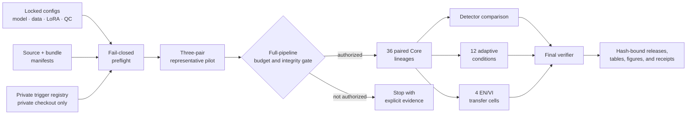

# LoRA Backdoor Audit

> An evidence-bound research pipeline for evaluating backdoor detection in
> Low-Rank Adaptation (LoRA) adapters through weight evidence, behavioral
> evidence, adaptive robustness analysis, and English–Vietnamese transfer.


LoRA Backdoor Audit is the source repository for a reproducible graduation
internship study of backdoor detection in LoRA adapters. It implements a locked,
paired experimental protocol around `Qwen/Qwen2.5-1.5B-Instruct` and the
English and Vietnamese portions of MASSIVE. The pipeline compares weight-only
and target-informed behavior-only detectors, Simple OR, and conditionally
calibrated fusion; it then evaluates an adaptive-surrogate stress test and
cross-language transfer.

The repository is deliberately strict about what counts as evidence. Synthetic
fixtures prove that orchestration works; they are not empirical findings.
Notebook metadata does not prove that a GPU was allocated. A local passing test
suite does not prove hosted execution, detector quality, or production safety.
Every research-stage claim must remain bound to the exact source, configuration,
runtime profile, receipts, and raw artifacts that produced it.

## Contents

- [Why this project exists](#why-this-project-exists)
- [Research scope](#research-scope)
- [System design](#system-design)
- [Locked scientific contract](#locked-scientific-contract)
- [Repository structure](#repository-structure)
- [Quick start](#quick-start)
- [Safe local smoke test](#safe-local-smoke-test)
- [Command-line interface](#command-line-interface)
- [Hosted Colab workflow](#hosted-colab-workflow)
- [Reproducibility and evidence](#reproducibility-and-evidence)
- [Public and private boundaries](#public-and-private-boundaries)
- [Documentation](#documentation)
- [Contributing](#contributing)
- [Citation](#citation)
- [License](#license)

## Why this project exists

Parameter-efficient fine-tuning makes it practical to distribute small adapter
artifacts independently of a base model. This project studies a narrow question:
under a preregistered, controlled protocol, what evidence can weight-space and
behavior-space detectors provide about paired clean and backdoored LoRA
adapters?

The implementation emphasizes four properties:

1. **Paired experimental units.** Every parent lineage contains a clean arm and
   a backdoored arm trained under a shared contract.
2. **Leakage-resistant evaluation.** Detector fitting, validation-only
   threshold selection, and held-out release are separate stages.
3. **Fail-closed execution.** Missing evidence, configuration drift, runtime
   mismatch, non-finite metrics, or receipt mismatch stops the affected stage.
4. **Claim discipline.** Engineering checks, smoke fixtures, hosted telemetry,
   statistical releases, and production claims are treated as different
   evidence classes.

This is a controlled research pipeline. It is not an adapter marketplace
scanner, an unknown-trigger discovery system, a malware sandbox, or a production
safety certification.

## Research scope

The Core protocol addresses three study areas.

### 1. Detector comparison

The pipeline compares four branches on held-out paired lineages:

| Branch | Evidence used | Intended interpretation |
|---|---|---|
| Weight-only | Canonical features derived from LoRA parameter updates | Static adapter-level signal |
| Behavior-only | Responses on a shared, hash-bound, target-informed probe battery | Controlled behavioral signal |
| Simple OR | Logical OR of locked weight and behavior decisions | Transparent non-learned baseline |
| Calibrated fusion | Grouped out-of-fold base scores with validation-only operating points | Conditional combined evidence |

Fusion remains exploratory unless its cross-fitting and effective-sample gates
pass. Held-out test observations never select or repair thresholds.

### 2. Adaptive robustness

Twelve locked continuation conditions combine three seeds with gradient-ratio
targets `0.0`, `0.1`, `0.3`, and `1.0`. The optimized objective uses a
weight-space Frobenius surrogate. Behavior and fusion are measured afterward;
they are not misrepresented as differentiable optimization targets.

This stage is an adaptive-surrogate stress test, not a proof of optimal or fully
detector-aware evasion.

### 3. English–Vietnamese transfer

The cross-language matrix contains four poison-language × probe-language cells:

- English → English
- English → Vietnamese
- Vietnamese → Vietnamese
- Vietnamese → English

The study separates attack transfer, detector discrimination transfer,
fixed-threshold transfer, and trigger-equivalence validity. One metric cannot
stand in for all four concepts.

## System design



The large-language model is measurement infrastructure inside the experiment;
it does not choose thresholds, change stage order, waive failures, authorize
spend, or decide which result should be reported. Deterministic code owns those
decisions, and unknown state fails closed.

When this repository is integrated into the private
`TranThienNhan_TTTN` Colab transfer bundle, the outer
`RUN_EXPERIMENT.ipynb` and `bootstrap.py` provide attestation, resumable staged
execution, and final verification. Git history and the pristine Colab upload
bundle are intentionally separate: the upload verifier rejects `.git/`,
bytecode, caches, runtime output, and unexpected files.

## Locked scientific contract

The authoritative values live in [`configs/core.yaml`](configs/core.yaml) and
the execution profiles under [`configs/execution/`](configs/execution/).

| Component | Core setting |
|---|---|
| Base model | `Qwen/Qwen2.5-1.5B-Instruct` at immutable revision `989aa7980e4cf806f80c7fef2b1adb7bc71aa306` |
| Dataset | `AmazonScience/massive` from revision-pinned Parquet assets |
| Locales | `en-US`, `vi-VN` |
| Task | 60-label causal-LM intent classification |
| Scoring | Mean conditional candidate log-likelihood; no free-generation scoring |
| LoRA | Rank `8`, alpha `16`, dropout `0.05`, locked projection modules |
| Core cohort | 36 paired lineages across 3 seeds, 3 trigger families, 2 poison rates, and 2 languages |
| Detector splits | 12 train, 12 validation, 12 test pairs |
| Adaptive stage | 12 locked conditions |
| Transfer stage | 4 English/Vietnamese cells |
| Uncertainty | 5,000 bootstrap iterations over parent lineages |
| Hosted Core runtime | Exact allowlisted NVIDIA A100 40GB profile; CUDA capability `8.0`; live BF16 probe; no fallback |

Paired quality control is fixed before hosted execution:

| Quantity | Pass condition |
|---|---:|
| Backdoored attack success rate | `>= 0.80` |
| Clean triggered target rate | `<= 0.20` |
| Paired attack-success lift | `>= 0.60` |
| Absolute clean-task macro-F1 difference | `<= 0.03` |

A threshold failure remains a recorded negative outcome. It is not silently
deleted, relabeled as valid, or used to weaken the threshold. An integrity
failure stops the protocol path that depends on it.

For the complete estimands, units, randomization rules, uncertainty procedures,
and claim boundaries, read
[`docs/protocol-v2.md`](docs/protocol-v2.md).

## Repository structure

```text
.
├── configs/
│   ├── core.yaml                    # Locked Core scientific configuration
│   ├── fixture.yaml                 # Synthetic smoke-only configuration
│   ├── target.yaml                  # Separate preregistered extension
│   ├── execution/                   # Immutable runtime contracts
│   └── protocol-amendment-v4.json  # Post-pilot classification amendment
├── docs/
│   ├── protocol-v2.md               # Scientific and evidentiary contract
│   ├── execution-runbook.md         # Private hosted-execution procedure
│   ├── colab-resumable-execution-design.md
│   └── chapter3-template.md         # Result-writing template without invented metrics
├── notebooks/
│   └── experiment_runner.ipynb      # Read-only attestation companion
├── private/
│   └── README.md                    # Private-input policy; no public literals
├── requirements/                    # Pinned base, development, and accelerated locks
├── schemas/                         # JSON Schemas for manifests and reports
├── scripts/                         # Validators, manifest builders, and readiness audit
├── src/lora_audit/                  # Python package and CLI implementation
├── tests/                           # Contract, unit, integration, and regression tests
├── .env.example                     # Non-secret local override template
└── pyproject.toml
```

Generated artifacts, executed notebooks, model/data caches, private triggers,
adapters, and local environments do not belong in the public source tree.

## Quick start

### Choose the correct verification boundary

A fresh Git clone is intentionally a **source-only checkout**. It excludes the
private trigger registry, generated manifests and runtime artifacts, and the
outer Colab entrypoints from the private `TranThienNhan_TTTN` transfer bundle.
Those exclusions are part of the security and evidence contract, not missing
release files.

This project therefore has two verification modes:

1. **Source-checkout verification** runs the public-safe unit and contract
   subset plus static checks using tracked files only.
2. **Private transfer-bundle verification** runs the complete test suite,
   project validator, and physical bundle verifier only after the source has
   been placed inside a pristine private transfer bundle with its required
   private inputs and generated manifests.

### Requirements

- Python `>=3.11,<3.14`
- A fresh virtual environment outside the repository
- No GPU for source-checkout verification and the synthetic fixture path
- An exact private A100 40GB environment only for the locked hosted protocol

Keeping the verification environment outside the repository prevents local
packages, bytecode, or environment metadata from contaminating source and
bundle integrity checks.

### Windows PowerShell

```powershell
$VerifierRoot = Join-Path ([IO.Path]::GetTempPath()) ("lora-audit-verify-" + [guid]::NewGuid())
py -3.12 -m venv $VerifierRoot
$Python = Join-Path $VerifierRoot "Scripts\python.exe"

& $Python -m pip install --upgrade pip
& $Python -m pip install -r requirements\dev.lock
& $Python -m pip install . --no-deps

$env:PYTHONPATH = "src"
$env:PYTHONDONTWRITEBYTECODE = "1"

$PublicTests = @(
    "tests/test_cli_compute_execution_profile.py"
    "tests/test_config_and_cohort.py"
    "tests/test_manifests_and_qc.py"
    "tests/test_metrics_thresholds.py"
    "tests/test_prompts.py"
    "tests/test_report_assets.py"
    "tests/test_source_delta.py"
    "tests/test_weight_behavior_detectors.py"
)

& $Python -m pytest -q -p no:cacheprovider @PublicTests
& $Python -m ruff format --check --no-cache .
& $Python -m ruff check --no-cache .
```

### Linux or macOS shell

```bash
VERIFY_ROOT="$(mktemp -d)/lora-audit-verify"
python3 -m venv "$VERIFY_ROOT"
PYTHON="$VERIFY_ROOT/bin/python"

"$PYTHON" -m pip install --upgrade pip
"$PYTHON" -m pip install -r requirements/dev.lock
"$PYTHON" -m pip install . --no-deps

export PYTHONPATH=src
export PYTHONDONTWRITEBYTECODE=1

"$PYTHON" -m pytest -q -p no:cacheprovider \
  tests/test_cli_compute_execution_profile.py \
  tests/test_config_and_cohort.py \
  tests/test_manifests_and_qc.py \
  tests/test_metrics_thresholds.py \
  tests/test_prompts.py \
  tests/test_report_assets.py \
  tests/test_source_delta.py \
  tests/test_weight_behavior_detectors.py
"$PYTHON" -m ruff format --check --no-cache .
"$PYTHON" -m ruff check --no-cache .
```

The source-checkout subset covers tracked implementation, CLI, configuration,
metric, schema, reporting, source-delta, and detector contracts that do not
require excluded private inputs. It is not a substitute for the complete
transfer-bundle gate.

### Complete private transfer-bundle gate

Run the complete gate only from `TranThienNhan_TTTN/lora-audit` inside a
pristine private transfer bundle. The sibling `../bootstrap.py` and
`../RUN_EXPERIMENT.ipynb`, the ignored private trigger registry, and the
generated manifests must already be present. Never copy `.git/` into this
bundle.

```bash
export PYTHONPATH=src
export PYTHONDONTWRITEBYTECODE=1

python scripts/build_source_manifest.py
python scripts/build_source_manifest.py --verify
python scripts/build_upload_bundle.py --bundle-root .. --refresh-bundle-manifest
python -m pytest -q -p no:cacheprovider
python scripts/validate_project.py
python scripts/build_upload_bundle.py --bundle-root .. --verify-only
```

The validator checks the locked configurations, schemas, notebook topology,
execution plan, fixture boundary, and other project-specific contracts. A pass
is local engineering evidence only. Missing private inputs or an incomplete
transfer layout must fail closed rather than being converted into a source-only
pass.

## Safe local smoke test

The fixture path is intentionally synthetic and harmless. It exercises pairing,
manifests, detector orchestration, report generation, and integrity checks
without downloading Qwen or MASSIVE and without training a real adapter.

PowerShell:

```powershell
$FixtureRoot = Join-Path ([IO.Path]::GetTempPath()) ("lora-audit-fixture-" + [guid]::NewGuid())
New-Item -ItemType Directory -Path $FixtureRoot | Out-Null

& $Python -m lora_audit.cli preflight --config configs\fixture.yaml --mode fixture --output (Join-Path $FixtureRoot "preflight.json")
& $Python -m lora_audit.cli smoke --config configs\fixture.yaml --output-root (Join-Path $FixtureRoot "run")
```

POSIX shell:

```bash
FIXTURE_ROOT="$(mktemp -d)"

"$PYTHON" -m lora_audit.cli preflight \
  --config configs/fixture.yaml \
  --mode fixture \
  --output "$FIXTURE_ROOT/preflight.json"

"$PYTHON" -m lora_audit.cli smoke \
  --config configs/fixture.yaml \
  --output-root "$FIXTURE_ROOT/run"
```

Every fixture artifact must retain:

```json
{
  "fixture_smoke_only": true
}
```

Removing or ignoring that marker invalidates the evidence boundary. Fixture
metrics must never be copied into a thesis table, abstract, benchmark
comparison, or detector-quality claim.

## Command-line interface

After installation:

```bash
lora-audit --help
```

The CLI exposes explicit stages for:

- fixture and strict preflight;
- data preparation and model prefetch;
- cohort planning, execution, and validated resume;
- compute estimation;
- detector fitting and held-out release;
- adaptive-condition execution and finalization;
- English/Vietnamese transfer-cell execution and finalization;
- evidence-consuming adapter triage;
- manifest validation and report generation.

Research execution commands require exact config, manifest, receipt, runtime,
and `--execute` capabilities. The CLI does not silently replace a requested
profile, shrink the scientific scope, or fall back to CPU or a different GPU.

## Hosted Colab workflow

Hosted execution is available only from a complete, private, manifest-bound
`TranThienNhan_TTTN` transfer bundle. The source repository alone intentionally
does not contain the private trigger registry, generated backdoored adapters, or
eligible result artifacts.

The private bundle workflow is:

1. Build and verify the source manifest.
2. Refresh and verify the derived outer bundle manifest.
3. Upload the exact bundle to private persistent storage.
4. Open the outer `RUN_EXPERIMENT.ipynb`.
5. Select the exact allowlisted NVIDIA A100 40GB runtime.
6. Run the notebook as a single, deterministic staged workflow.
7. Treat the study as complete only after the final completion receipt and all
   referenced artifacts revalidate.

The plan caps an attempt at 12 A100 device-hours and reserves 20% for managed
runtime risk. That value is a maximum exposure, not a promise that Colab will
provide the runtime or complete the study. Platform authorization, GPU
availability, storage, and compute-unit balance remain external preconditions.

Do not initialize Git inside the pristine Colab transfer bundle. Do not upload a
Git working tree as the experimental package. Maintain the GitHub repository in
a separate checkout, then build the private transfer artifact through the
official manifest workflow.

Maintainers working inside the private integration workspace use the owning
generators:

```bash
python scripts/build_source_manifest.py
python scripts/build_source_manifest.py --verify
python scripts/build_upload_bundle.py --bundle-root .. --refresh-bundle-manifest
python scripts/build_upload_bundle.py --bundle-root .. --verify-only
```

The final command requires the exact parent directory name and outer bundle
entrypoints. It is not expected to pass in a standalone public clone.

See [`docs/execution-runbook.md`](docs/execution-runbook.md) for the full
attestation, pilot, budget, cohort, recovery, and result-verification contract.

## Reproducibility and evidence

### Source and configuration binding

The pipeline binds execution to:

- immutable model, tokenizer, and dataset revisions;
- normalized data and split hashes;
- the scientific configuration hash;
- the execution-profile semantic and file hashes;
- the source-tree and bundle-tree manifests;
- private-input attestations without public trigger disclosure;
- exact lineage, adapter, telemetry, and stage receipts.

Changing any bound input invalidates dependent preflight, resume, calibration,
or release artifacts.

### Resume safety

A completed unit is skipped only after its identity, source bindings, input
hashes, output hashes, and completion state revalidate. Incomplete work is not
converted into success. Pilot timing never resumes a partial unit when doing so
would undercount its cost.

### Statistical discipline

- The parent lineage is the independent experimental unit.
- Clean and backdoored arms share the paired training contract.
- Thresholds are selected on validation data only.
- Test evidence remains sealed until release.
- Bootstrap resampling uses parent lineages rather than treating repeated
  examples as independent adapters.
- Planned, attempted, completed, QC-valid, and failed counts remain distinct.

### Evidence status

| Evidence class | What it can support | What it cannot support |
|---|---|---|
| Static source and schema checks | Structural consistency | Runtime success or detector quality |
| Synthetic fixture | Local orchestration executability | Qwen/MASSIVE findings |
| Notebook contract and metadata | Intended stage topology | Actual A100 allocation |
| Live strict preflight | Observed runtime compatibility for that session | Completed experiment |
| Pilot telemetry and receipts | Source-bound feasibility estimate | Full-cohort findings |
| Verified raw research releases | Claims covered by their exact estimands | Production safety or unknown-trigger detection |

This repository does not ship thesis results. It contains source, protocol,
tests, and engineering contracts. Any separate report or paper must cite the
eligible raw release that supports each empirical statement.

## Public and private boundaries

The public repository may contain:

- implementation source;
- tests and synthetic fixtures;
- schemas and locked non-secret configurations;
- protocol and execution documentation;
- opaque trigger-family identifiers and harmless target-intent identifiers.

The public repository must not contain:

- `private/trigger_registry.yaml`;
- literal private triggers or semantic equivalents;
- generated backdoored adapters;
- model or dataset caches;
- `.env` files, tokens, credentials, or cloud identifiers;
- runtime telemetry tied to private infrastructure;
- executed notebook outputs;
- generated artifacts under `artifacts/` or `run-output/`;
- local absolute paths, bytecode, virtual environments, or Git metadata inside
  a release bundle.

The tracked [`.gitignore`](.gitignore) excludes these categories, but ignore
rules are not a security review. Before any public push, inspect the staged file
set and run a secret scan. Never use `git add -f` to bypass the private boundary.

The behavior branch is target informed. Public documentation must not describe
it as unknown-trigger discovery.

## Documentation

| Document | Purpose |
|---|---|
| [`docs/protocol-v2.md`](docs/protocol-v2.md) | Scientific units, estimands, thresholds, uncertainty, and claim boundaries |
| [`docs/execution-runbook.md`](docs/execution-runbook.md) | Private hosted execution, recovery, and final-verification procedure |
| [`docs/colab-resumable-execution-design.md`](docs/colab-resumable-execution-design.md) | Design rationale for source-bound resumable orchestration |
| [`docs/chapter3-template.md`](docs/chapter3-template.md) | Evidence-aware result-writing structure without fabricated metrics |
| [`private/README.md`](private/README.md) | Policy for private triggers and adapter artifacts |

## Contributing

Contributions should preserve the protocol and evidence boundaries:

1. Open an issue describing the problem, affected contract, and intended
   verifier.
2. Keep protocol changes separate from runtime-only optimizations.
3. Add or update regression tests for every behavior change.
4. Never weaken a preflight, QC threshold, manifest check, or release gate to
   make a test pass.
5. Run tests, Ruff, the project validator, and the applicable manifest checks.
6. Document any change to estimands, randomization, sample counts, thresholds,
   model/data revisions, or execution profiles as an explicit protocol
   amendment.
7. Do not include private triggers, adapters, credentials, or empirical results
   in a pull request.

Formatting success is not semantic verification. Review the final diff and
confirm that source, tests, docs, and protocol claims still agree.

## Citation

This repository does not currently include a release DOI or `CITATION.cff`.
Until versioned citation metadata is added, use the following provisional form
and replace the placeholders with the tagged release and repository URL:

```text
Trần Thiện Nhân. (2026). LoRA Backdoor Audit: An Evidence-Bound Research
Pipeline (Version <release>). <repository URL>.
```

When citing an empirical result, also cite the exact thesis, paper, or
hash-bound research release that contains the supporting raw evidence. Citing
the source repository alone is not evidence for a numerical finding.

## License

No standalone open-source `LICENSE` file is currently included. Repository
visibility alone does not grant permission to copy, modify, or redistribute the
software. Add an explicit license before presenting the project as open source.
Private triggers, generated adapters, third-party models, and datasets may have
separate terms and are not relicensed by this repository.

---

Developed by **Trần Thiện Nhân** as a graduation internship research project.
The project uses AI systems as experimental infrastructure and software
assistance, not as scientific authors or authorities.
